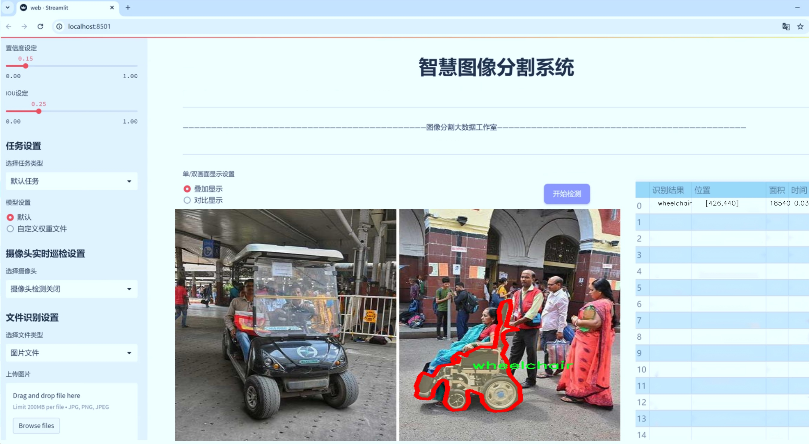
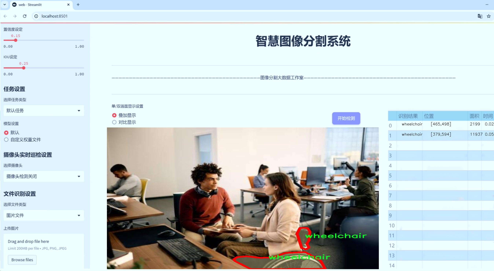
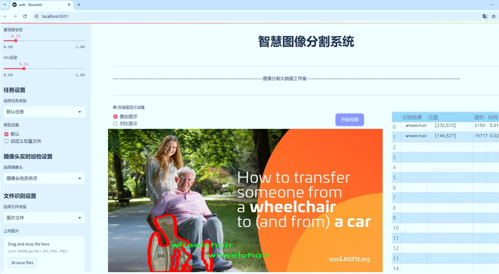
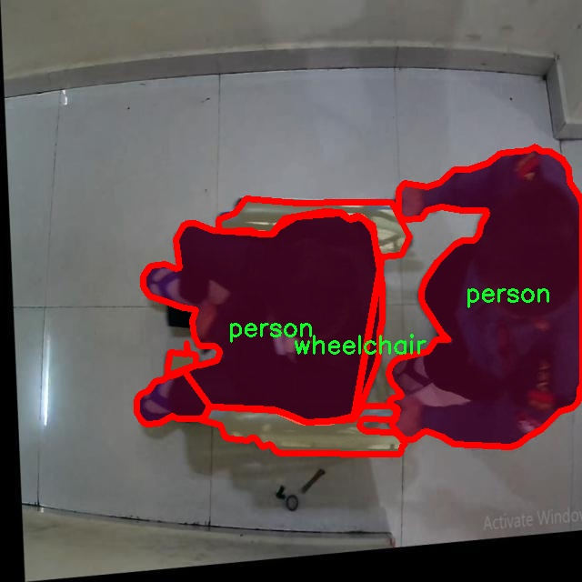
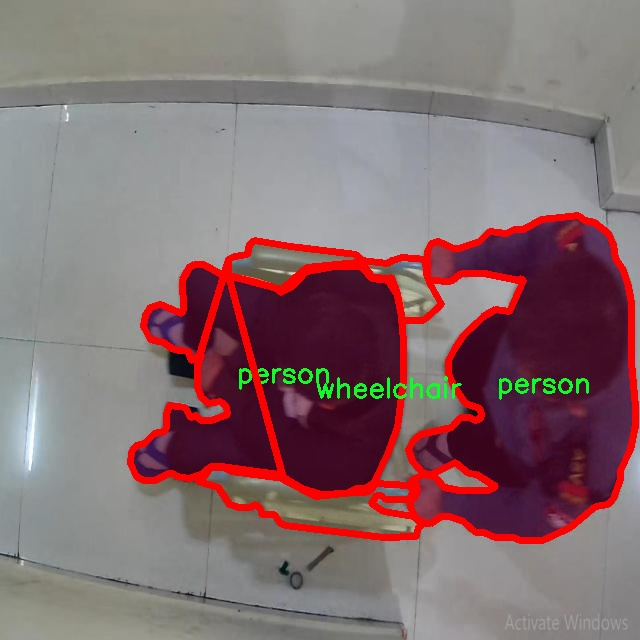
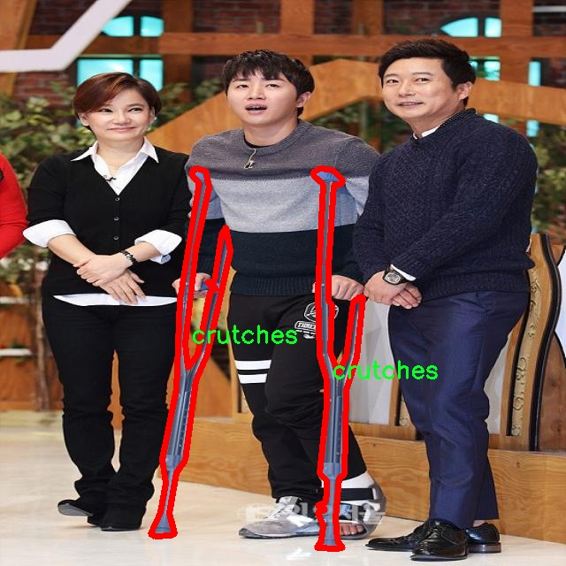
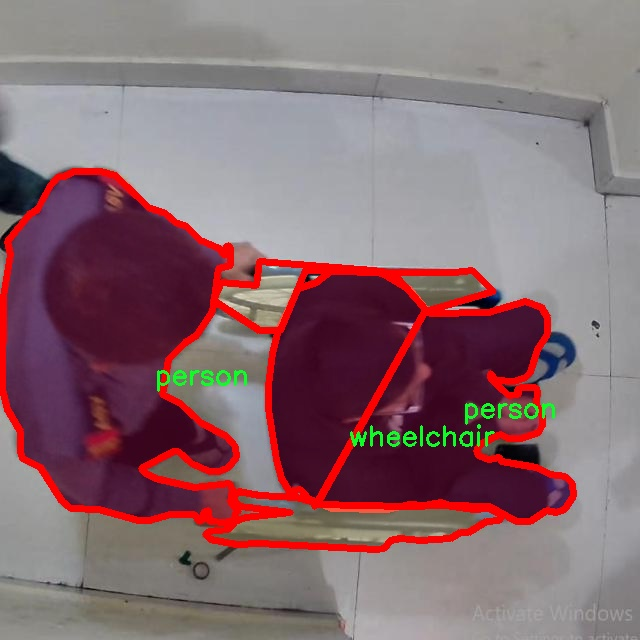
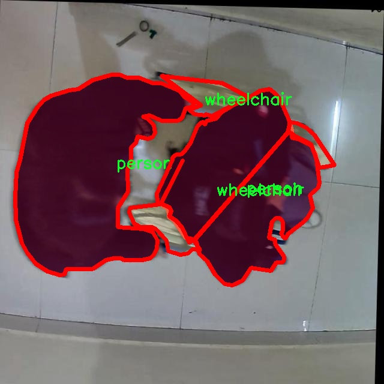

# 辅助设备图像分割系统： yolov8-seg-rtdetr

### 1.研究背景与意义

[参考博客](https://gitee.com/YOLOv8_YOLOv11_Segmentation_Studio/projects)

[博客来源](https://kdocs.cn/l/cszuIiCKVNis)

研究背景与意义

随着全球老龄化问题的日益严重，辅助设备的使用频率显著增加，尤其是在老年人和残疾人群体中。辅助设备如拐杖、轮椅等，不仅能够提高用户的生活质量，还能增强其独立性。然而，传统的辅助设备使用监测和管理方法往往依赖人工检查，效率低下且容易出错。因此，开发一种高效、自动化的辅助设备图像分割系统显得尤为重要。基于改进YOLOv8的图像分割技术，能够在实时监测中准确识别和分割不同类型的辅助设备，从而为相关领域的研究和应用提供强有力的支持。

在这一背景下，ELSA2数据集的引入为研究提供了坚实的基础。该数据集包含2100张图像，涵盖了三类主要对象：拐杖、轮椅和人。这些数据不仅数量充足，而且种类多样，能够有效支持模型的训练和测试。通过对这些图像进行实例分割，研究者可以实现对不同辅助设备的精确识别与定位，进而推动智能监测系统的实现。这一过程不仅涉及到计算机视觉领域的深度学习技术，还需要结合图像处理、模式识别等多学科的知识，具有较高的研究价值。

YOLO（You Only Look Once）系列模型因其快速的检测速度和良好的准确性而广受欢迎。YOLOv8作为该系列的最新版本，进一步提升了模型的性能，尤其是在小物体检测和实例分割方面。通过对YOLOv8进行改进，研究者可以针对辅助设备的特征进行优化，从而提高模型在复杂环境下的鲁棒性和适应性。这种改进不仅能够提升图像分割的精度，还能为实时应用提供更好的支持，使得辅助设备的监测与管理更加高效。

此外，基于改进YOLOv8的辅助设备图像分割系统的研究，具有重要的社会意义。通过实现对辅助设备的自动识别与监测，可以为老年人和残疾人提供更为人性化的服务。例如，在智能家居环境中，系统能够实时监测用户的活动状态，及时提供帮助或提醒，降低意外事故的发生率。同时，该系统还可以为医疗机构、康复中心等提供数据支持，帮助专业人员更好地了解用户的使用情况，从而制定更为科学的康复方案。

综上所述，基于改进YOLOv8的辅助设备图像分割系统的研究，不仅在技术层面具有重要的创新意义，更在社会层面展现出广泛的应用前景。通过这一研究，期望能够推动辅助设备的智能化发展，为提升老年人和残疾人的生活质量贡献力量。同时，该研究也为计算机视觉领域的进一步探索提供了新的思路和方向，具有重要的学术价值。

### 2.图片演示







注意：本项目提供完整的训练源码数据集和训练教程,由于此博客编辑较早,暂不提供权重文件（best.pt）,需要按照6.训练教程进行训练后实现上图效果。

### 3.视频演示

[3.1 视频演示](https://www.bilibili.com/video/BV1WazgYgEoU/)

### 4.数据集信息

##### 4.1 数据集类别数＆类别名

nc: 3
names: ['crutches', 'person', 'wheelchair']


##### 4.2 数据集信息简介

数据集信息展示

在现代计算机视觉领域，图像分割技术的进步为辅助设备的识别与分类提供了强有力的支持。为此，本研究采用了名为“ELSA2”的数据集，以训练和改进YOLOv8-seg模型，旨在提升对辅助设备的图像分割能力。该数据集专注于三种主要类别，分别是拐杖（crutches）、人（person）和轮椅（wheelchair），这些类别的选择不仅反映了日常生活中常见的辅助设备，也为相关领域的研究提供了丰富的应用场景。

“ELSA2”数据集的构建经过精心设计，确保了图像的多样性和代表性。数据集中包含了不同环境、不同光照条件下的图像，涵盖了城市街道、室内场所以及公共交通等多种场景。这种多样性使得模型在训练过程中能够学习到更为广泛的特征，从而提高其在实际应用中的鲁棒性。例如，拐杖的图像可能在不同的使用场景中呈现出不同的姿态和角度，而轮椅则可能在不同的背景下与其他物体交互。这些变化为模型提供了丰富的训练数据，使其能够更好地适应复杂的现实环境。

数据集中每个类别的标注都经过严格审核，确保了标注的准确性和一致性。拐杖的标注不仅包括了其主体部分，还考虑到了使用者的手部位置，确保模型能够准确识别出拐杖的使用状态。对于“人”这一类别，数据集中的标注涵盖了不同性别、年龄和体型的人物，确保了模型在识别过程中能够兼顾多样性和普适性。轮椅的标注则考虑到了不同类型的轮椅，包括手动轮椅和电动轮椅，进一步丰富了模型的学习样本。

在数据集的使用过程中，研究者们还特别关注了数据的平衡性。通过对各类别样本数量的合理配置，确保了模型在训练时不会偏向某一特定类别，从而提升了整体的分割性能。这种平衡不仅有助于提高模型的准确性，还能在实际应用中降低误识别的风险。

为了进一步提升模型的性能，研究者们还计划对“ELSA2”数据集进行数据增强处理，包括旋转、缩放、翻转等操作，以增加训练样本的多样性。这种数据增强技术能够有效提高模型的泛化能力，使其在面对未见过的图像时仍能保持较高的识别准确率。

总之，“ELSA2”数据集为训练和改进YOLOv8-seg模型提供了坚实的基础。通过对拐杖、人物和轮椅这三种类别的深入研究，结合丰富的场景和多样的标注，研究者们期望能够开发出一种更为高效的辅助设备图像分割系统。这不仅将推动计算机视觉技术的发展，也将为辅助设备的使用者提供更为便捷的服务，助力社会的无障碍建设。











### 5.项目依赖环境部署教程（零基础手把手教学）

[5.1 环境部署教程链接（零基础手把手教学）](https://www.bilibili.com/video/BV1jG4Ve4E9t/?vd_source=bc9aec86d164b67a7004b996143742dc)


[5.2 安装Python虚拟环境创建和依赖库安装视频教程链接（零基础手把手教学）](https://www.bilibili.com/video/BV1nA4VeYEze/?vd_source=bc9aec86d164b67a7004b996143742dc)

### 6.手把手YOLOV8-seg训练视频教程（零基础手把手教学）

[6.1 手把手YOLOV8-seg训练视频教程（零基础小白有手就能学会）](https://www.bilibili.com/video/BV1cA4VeYETe/?vd_source=bc9aec86d164b67a7004b996143742dc)


按照上面的训练视频教程链接加载项目提供的数据集，运行train.py即可开始训练



     Epoch   gpu_mem       box       obj       cls    labels  img_size
     1/200     0G   0.01576   0.01955  0.007536        22      1280: 100%|██████████| 849/849 [14:42<00:00,  1.04s/it]
               Class     Images     Labels          P          R     mAP@.5 mAP@.5:.95: 100%|██████████| 213/213 [01:14<00:00,  2.87it/s]
                 all       3395      17314      0.994      0.957      0.0957      0.0843

     Epoch   gpu_mem       box       obj       cls    labels  img_size
     2/200     0G   0.01578   0.01923  0.007006        22      1280: 100%|██████████| 849/849 [14:44<00:00,  1.04s/it]
               Class     Images     Labels          P          R     mAP@.5 mAP@.5:.95: 100%|██████████| 213/213 [01:12<00:00,  2.95it/s]
                 all       3395      17314      0.996      0.956      0.0957      0.0845

     Epoch   gpu_mem       box       obj       cls    labels  img_size
     3/200     0G   0.01561    0.0191  0.006895        27      1280: 100%|██████████| 849/849 [10:56<00:00,  1.29it/s]
               Class     Images     Labels          P          R     mAP@.5 mAP@.5:.95: 100%|███████   | 187/213 [00:52<00:00,  4.04it/s]
                 all       3395      17314      0.996      0.957      0.0957      0.0845


### 7.50+种全套YOLOV8-seg创新点加载调参实验视频教程（一键加载写好的改进模型的配置文件）

[7.1 50+种全套YOLOV8-seg创新点加载调参实验视频教程（一键加载写好的改进模型的配置文件）](https://www.bilibili.com/video/BV1Hw4VePEXv/?vd_source=bc9aec86d164b67a7004b996143742dc)

### YOLOV8-seg算法简介

原始YOLOV8-seg算法原理

YOLO（You Only Look Once）系列算法在计算机视觉领域中取得了显著的进展，尤其是在目标检测和实例分割任务中。YOLOv8-seg作为该系列的最新版本，进一步推动了实时目标检测技术的发展。该算法不仅继承了YOLO系列的优良传统，还在多个方面进行了创新和优化，尤其是在网络结构、损失函数和训练策略等方面，展现出其卓越的性能。

YOLOv8-seg算法的基本架构由三个主要部分组成：输入端（Input）、主干网络（Backbone）和检测端（Head）。在这三个部分中，主干网络是特征提取的核心，负责从输入图像中提取出有用的特征信息。YOLOv8-seg的主干网络采用了一系列卷积和反卷积层，结合了残差连接和瓶颈结构，以减小网络的复杂度并提高其性能。特别地，YOLOv8-seg引入了C2f模块，这一模块是对YOLOv5中的C3模块和YOLOv7中的ELAN模块的结合，增加了更多的残差连接，使得网络在轻量化的同时能够获得更丰富的梯度信息。这种设计不仅提高了特征提取的效率，还增强了模型的表达能力，使其能够更好地处理复杂的视觉任务。

在特征融合方面，YOLOv8-seg依然采用了PAN-FPN（Path Aggregation Network - Feature Pyramid Network）结构，尽管对上采样部分的卷积结构进行了删减。这种特征融合策略使得来自不同尺度的特征图能够有效地结合，从而提升了对不同尺寸目标的检测能力。通过多尺度特征的融合，YOLOv8-seg能够在处理小目标和高分辨率图像时表现出色，充分展现了其在实例分割任务中的优势。

YOLOv8-seg的检测端则采用了最新的解耦合头结构，这一结构将分类和检测任务分离，使得模型在进行目标检测时能够更加高效。与传统的Anchor-Based方法不同，YOLOv8-seg引入了Anchor-Free的检测策略，这一创新使得模型在处理目标时不再依赖于预设的锚框，从而提高了检测的灵活性和准确性。此外，YOLOv8-seg的检测头设计中不再包含objectness分支，而是将重点放在解耦的分类和回归分支上，这一变化进一步简化了模型的结构，使得训练和推理过程更加高效。

在损失函数的设计上，YOLOv8-seg采用了BCELoss作为分类损失，DFLLoss和CIoULoss作为回归损失。这种组合损失函数的设计不仅提高了模型的收敛速度，还增强了目标检测的精度，使得YOLOv8-seg在各类数据集上的表现都十分出色。尤其是在COCO数据集上的实验结果显示，YOLOv8-seg在精度和执行时间上均优于以往的模型，展现出其作为最先进目标检测模型的潜力。

此外，YOLOv8-seg在训练过程中引入了动态的Task-Aligned Assigner样本分配策略，这一策略使得模型在训练过程中能够更好地适应不同的任务需求，从而提高了训练的效率和效果。同时，在数据增强方面，YOLOv8-seg借鉴了YOLOv5中的策略，在训练的最后10个epoch中关闭马赛克增强，这一设计旨在减少训练过程中的噪声干扰，使得模型能够更加专注于学习目标的特征。

YOLOv8-seg的设计理念不仅体现在其网络结构的创新上，还体现在其在不同硬件平台上的灵活性。无论是在CPU还是GPU上，YOLOv8-seg都能够高效运行，充分满足实时应用的需求。这一特性使得YOLOv8-seg在实际应用中具有广泛的适用性，无论是在智能监控、自动驾驶还是工业检测等领域，都能够发挥其强大的性能。

综上所述，YOLOv8-seg算法通过一系列创新和优化，展现出其在目标检测和实例分割任务中的强大能力。其主干网络的高效特征提取、灵活的特征融合策略、解耦合的检测头设计以及精确的损失函数组合，使得YOLOv8-seg在计算机视觉领域中树立了新的标杆。随着技术的不断进步，YOLOv8-seg无疑将在未来的研究和应用中发挥更为重要的作用。


### 9.系统功能展示（检测对象为举例，实际内容以本项目数据集为准）

图9.1.系统支持检测结果表格显示

  图9.2.系统支持置信度和IOU阈值手动调节

  图9.3.系统支持自定义加载权重文件best.pt(需要你通过步骤5中训练获得)

  图9.4.系统支持摄像头实时识别

  图9.5.系统支持图片识别

  图9.6.系统支持视频识别

  图9.7.系统支持识别结果文件自动保存

  图9.8.系统支持Excel导出检测结果数据


### 10.50+种全套YOLOV8-seg创新点原理讲解（非科班也可以轻松写刊发刊，V11版本正在科研待更新）

#### 10.1 由于篇幅限制，每个创新点的具体原理讲解就不一一展开，具体见下列网址中的创新点对应子项目的技术原理博客网址【Blog】：


[10.1 50+种全套YOLOV8-seg创新点原理讲解链接](https://gitee.com/qunmasj/good)

#### 10.2 部分改进模块原理讲解(完整的改进原理见上图和技术博客链接)【如果此小节的图加载失败可以通过CSDN或者Github搜索该博客的标题访问原始博客，原始博客图片显示正常】

### YOLOv8简介
#### YOLOv8是什么？
YOLOv8是Ultralytics公司推出的基于对象检测模型的YOLO最新系列，它能够提供截至目前最先进的对象检测性能。

借助于以前的YOLO模型版本支持技术，YOLOv8模型运行得更快、更准确，同时为执行任务的训练模型提供了统一的框架，这包括：

目标检测
实例分割
图像分类
在撰写本文时，Ultralytics的YOLOv8存储库中其实还有很多功能有待添加，这包括训练模型的整套导出功能等。此外，Ultralytics将计划在Arxiv上发布一篇相关的论文，将对YOLOv8与其他最先进的视觉模型进行比较。

#### YOLOv8的新功能
Ultralytics为YOLO模型发布了一个全新的存储库（https://github.com/ultralytics/ultralytics）。该存储库被构建为用于训练对象检测、实例分割和图像分类模型的统一框架。

以下列举的是这个新版本的一些关键功能：

用户友好的API（命令行+Python）。
更快、更准确。
支持：
目标检测，
实例分割和
图像分类。
可扩展到所有以前的版本。
新的骨干网络。
新的Anchor-Free head对象检测算法。
新的损失函数。
此外，YOLOv8也非常高效和灵活，它可以支持多种导出格式，而且该模型可以在CPU和GPU上运行。

#### YOLOv8中提供的子模型


YOLOv8模型的每个类别中共有五个模型，以便共同完成检测、分割和分类任务。其中，YOLOv8 Nano是最快和最小的模型，而YOLOv8Extra Large（YOLOv8x）是其中最准确但最慢的模型。

YOLOv8这次发行中共附带了以下预训练模型：

在图像分辨率为640的COCO检测数据集上训练的对象检测检查点。
在图像分辨率为640的COCO分割数据集上训练的实例分割检查点。
在图像分辨率为224的ImageNet数据集上预处理的图像分类模型。
### 高效网络架构 CloAtt简介
众所周知，自从 ViTs 提出后，Transformer 基本横扫各大 CV 主流任务，包括视觉识别、目标检测和语义分割等。然而，一个比较棘手的问题就是这个架构参数量和计算量太大，所以一直被广受诟病。因此，后续有不少工作都是朝着这个方向去改进，例如 Swin-Transformer 在局部非重叠窗口中进行注意力计算，而 PVT 中则是使用平均池化来合并 token 以进一步压缩耗时。然而，这些 ViTs 由于其参数量太大以及高 FLOPs 并不适合部署到移动设备。如果我们直接缩小到适合移动设备的尺寸时，它们的性能又会显著降低。


#### MobileViT
因此，出现了不少工作聚焦于探索轻量级的视觉变换器，使 ViTs 适用于移动设备，CVHub 此前也介绍过不少的工作，大家有兴趣可以翻阅历史文章读读。例如，苹果团队提出的 MobileViT 研究了如何将 CNN 与 Transformer 相结合，而另一个工作 MobileFormer 则将轻量级的 MobileNet 与 Transformer 进行融合。此外，最新提出的 EdgeViT 提出了一个局部-全局-局部模块来聚合信息。以上工作的目标都是设计具有高性能、较少参数和低 FLOPs 的移动端友好型模型。


#### EdgeViT
然而，作者从频域编码的角度认为，在现有的轻量级模型中，大多数方法只关注设计稀疏注意力，以有效地处理低频全局信息，而使用相对简单的方法处理高频局部信息。具体而言，大多数模型如 EdgeViT 和 MobileViT，只是简单使用原始卷积提取局部表示，这些方法仅使用卷积中的全局共享权重处理高频本地信息。其他方法，如 LVT ，则是首先将标记展开到窗口中，然后使用窗口内的注意力获得高频信息。这些方法仅使用特定于每个 Token 的上下文感知权重进行局部感知。


#### LVT
虽然上述轻量级模型在多个数据集上取得了良好的结果，但没有一种方法尝试设计更有效的方法，即利用共享和上下文感知权重的优势来处理高频局部信息。基于共享权重的方法，如传统的卷积神经网络，具有平移等变性的特征。与它们不同，基于上下文感知权重的方法，如 LVT 和 NAT，具有可以随输入内容变化的权重。这两种类型的权重在局部感知中都有自己的优势。
#### NAT


受该博客的启发，本文设计了一种轻量级视觉变换器——CloAtt，其利用了上下文感知的局部增强。特别地，CloAtt 采用了双分支设计结构。
#### 局部分支
在局部分支中，本文引入了一个精心设计的 AttnConv，一种简单而有效的卷积操作符，它采用了注意力机制的风格。所提出的 AttnConv 有效地融合了共享权重和上下文感知权重，以聚合高频的局部信息。具体地，AttnConv 首先使用深度卷积（DWconv）提取局部表示，其中 DWconv 具有共享权重。然后，其使用上下文感知权重来增强局部特征。与 Non-Local 等生成上下文感知权重的方法不同，AttnConv 使用门控机制生成上下文感知权重，引入了比常用的注意力机制更强的非线性。此外，AttnConv 将卷积算子应用于 Query 和 Key 以聚合局部信息，然后计算 Q 和 K 的哈达玛积，并对结果进行一系列线性或非线性变换，生成范围在 [-1,1] 之间的上下文感知权重。值得注意的是，AttnConv 继承了卷积的平移等变性，因为它的所有操作都基于卷积。
#### 全局分支
在全局分支中则使用了传统的注意力机制，但对 K 和 V 进行了下采样以减少计算量，从而捕捉低频全局信息。最后，CloFormer 通过简单的方法将局部分支和全局分支的输出进行融合，从而使模型能够同时捕捉高频和低频信息。总的来说，CloFormer 的设计能够同时发挥共享权重和上下文感知权重的优势，提高其局部感知的能力，使其在图像分类、物体检测和语义分割等多个视觉任务上均取得了优异的性能。
如上图2所示，CloFormer 共包含一个卷积主干和四个 stage，每个 stage you Clo 模块 和 ConvFFN 组合而成的模块堆叠而成 。具体得，首先将输入图像通过卷积主干传递，以获取 token 表示。该主干由四个卷积组成，每个卷积的步长依次为2、2、1和1。接下来，tokens 经历四个 Clo 块和 ConvFFN 阶段，以提取分层特征。最后，再利用全局平均池化和全连接层生成预测结果。可以看出，整个架构非常简洁，支持即插即用！


#### ConvFFN
为了将局部信息融入 FFN 过程中，本文采用 ConvFFN 替换了常用的 FFN。ConvFFN 和常用的 FFN 的主要区别在于，ConvFFN 在 GELU 激活函数之后使用了深度卷积（DWconv），从而使 ConvFFN 能够聚合局部信息。由于DWconv 的存在，可以直接在 ConvFFN 中进行下采样而不需要引入 PatchMerge 模块。CloFormer 使用了两种ConvFFN。第一种是在阶段内的 ConvFFN，它直接利用跳跃连接。另一种是连接两个阶段的 ConvFFN，主要用于下采样操作。
#### Clo block
CloFormer 中的 Clo块 是非常关键的组件。每个 Clo 块由一个局部分支和一个全局分支组成。在全局分支中，我们首先下采样 K 和 V，然后对 Q、K 和 V 进行标准的 attention 操作，以提取低频全局信息。
虽然全局分支的设计能够有效减少注意力机制所需的浮点运算次数，并且能够获得全局的感受野。然而，它在处理高频局部信息方面的能力不足。为了解决这个问题，CloFormer 引入了局部分支，并使用 AttnConv 对高频局部信息进行处理。AttnConv 可以融合共享权重和上下文感知权重，能够更好地处理高频局部信息。因此，CloFormer 结合了全局和局部的优势来提高图像分类性能。下面我们重点讲下 AttnConv 。
#### AttnConv
AttnConv 是一个关键模块，使得所提模型能够获得高性能。它结合了一些标准的 attention 操作。具体而言，在AttnConv 中，我们首先进行线性变换以获得 Q、K和V。在进行线性变换之后，我们再对 V 进行共享权重的局部特征聚合。然后，基于处理后的 V 和 Q ，K 进行上下文感知的局部增强。具体流程可对照流程图理解，我们可以将其拆解成三个步骤。
#### Local Feature Aggregation
为了简单起见，本文直接使用一个简单的深度卷积（DWconv）来对 V 进行局部信息聚合。
#### Context-aware Local Enhancement
在将具有共享权重的局部信息整合到 V 中后，我们结合 Q 和 K 生成上下文感知权重。值得注意的是，我们使用了与局部自注意力不同的方法，该方法更加简洁。具体而言，我们首先使用两个 DWconv 对 Q 和 K 分别进行局部信息聚合。然后，我们计算 Q 和 K 的 Hadamard 乘积，并对结果进行一系列转换，以获取在 -1 到 1 之间的上下文感知权重。最后，我们使用生成的权重来增强局部特征。
#### Fusion with Global Branch
在整个 CloFormer 中，我们使用一种简单直接的方法来将局部分支和全局分支的输出进行融合。具体而言，本文是通过将这两个输出在通道维度上进行直接拼接，然后再通过一个 FC 层聚合这些特征并结合残差输出。
最后，上图展示了三种不同的方法。相比于传统卷积，AttnConv 中的上下文感知权重使得模型能够更好地适应输入内容。相比于局部自注意力机制，引入共享权重使得模型能够更好地处理高频信息，从而提高性能。此外，生成上下文感知权重的方法引入了更强的非线性性，也提高了性能。需要注意的是，AttnConv 中的所有操作都基于卷积，保持了卷积的平移等变性特性。


### 11.项目核心源码讲解（再也不用担心看不懂代码逻辑）

#### 11.1 ultralytics\nn\tasks.py

以下是对给定代码的核心部分进行提炼和详细注释的结果。为了简化和聚焦于核心功能，去掉了一些辅助函数和不必要的部分，保留了模型的基本结构和功能。

```python
import torch
import torch.nn as nn
from ultralytics.utils.loss import v8DetectionLoss

class BaseModel(nn.Module):
    """BaseModel类是所有Ultralytics YOLO模型的基类。"""

    def forward(self, x, *args, **kwargs):
        """
        模型的前向传播方法，调用不同的处理方式。
        
        Args:
            x (torch.Tensor | dict): 输入图像张量或包含图像张量和标签的字典。
        
        Returns:
            (torch.Tensor): 网络的输出。
        """
        if isinstance(x, dict):  # 训练和验证时的情况
            return self.loss(x, *args, **kwargs)
        return self.predict(x, *args, **kwargs)

    def predict(self, x):
        """
        通过网络进行前向传播。
        
        Args:
            x (torch.Tensor): 输入张量。
        
        Returns:
            (torch.Tensor): 模型的最后输出。
        """
        return self._predict_once(x)

    def _predict_once(self, x):
        """
        执行一次前向传播。
        
        Args:
            x (torch.Tensor): 输入张量。
        
        Returns:
            (torch.Tensor): 模型的最后输出。
        """
        y = []  # 输出列表
        for m in self.model:  # 遍历模型中的每一层
            x = m(x)  # 运行当前层
            y.append(x)  # 保存输出
        return x  # 返回最后一层的输出

    def loss(self, batch):
        """
        计算损失。
        
        Args:
            batch (dict): 用于计算损失的批次数据。
        
        Returns:
            (torch.Tensor): 计算得到的损失值。
        """
        preds = self.forward(batch['img'])  # 前向传播获取预测
        return self.criterion(preds, batch)  # 计算损失

    def init_criterion(self):
        """初始化损失标准，子类需要实现该方法。"""
        raise NotImplementedError('compute_loss() needs to be implemented by task heads')


class DetectionModel(BaseModel):
    """YOLOv8检测模型。"""

    def __init__(self, cfg='yolov8n.yaml', ch=3, nc=None):
        """初始化YOLOv8检测模型。"""
        super().__init__()
        self.yaml = cfg  # 配置文件
        self.model, self.save = self.parse_model(self.yaml, ch)  # 解析模型

    def parse_model(self, yaml, ch):
        """解析模型配置，构建模型结构。"""
        # 这里省略了具体的解析逻辑，假设返回模型和保存列表
        return nn.Sequential(), []  # 返回一个空的模型和保存列表

    def init_criterion(self):
        """初始化YOLOv8检测模型的损失标准。"""
        return v8DetectionLoss(self)  # 返回检测损失


# 下面是一些模型的实例化示例
if __name__ == "__main__":
    model = DetectionModel(cfg='yolov8n.yaml', ch=3, nc=80)  # 创建YOLOv8检测模型实例
    print(model)  # 打印模型结构
```

### 代码说明：
1. **BaseModel类**：作为所有YOLO模型的基类，提供了基本的前向传播和损失计算方法。
   - `forward`方法：根据输入类型决定是进行预测还是计算损失。
   - `predict`和`_predict_once`方法：执行模型的前向传播。
   - `loss`方法：计算模型的损失。

2. **DetectionModel类**：继承自`BaseModel`，专门用于YOLOv8的检测任务。
   - `__init__`方法：初始化模型并解析配置文件。
   - `parse_model`方法：解析模型配置并构建模型结构（具体实现省略）。
   - `init_criterion`方法：初始化损失标准为YOLOv8检测损失。

### 重点：
- 代码中保留了模型的基本结构和功能，去掉了不必要的复杂性，便于理解和扩展。
- 注释详细解释了每个方法的功能和参数，帮助理解代码的工作原理。

这个文件是Ultralytics YOLO（You Only Look Once）系列模型的实现，主要用于目标检测、图像分割、姿态估计和分类等任务。文件中定义了多个类和函数，下面是对其主要内容的讲解。

首先，文件导入了一些必要的库，包括PyTorch、timm（用于处理图像模型）、以及Ultralytics自定义的模块和工具函数。这些导入的模块提供了构建和训练深度学习模型所需的基本功能。

接下来，定义了一个基类`BaseModel`，它继承自`nn.Module`。这个类为所有YOLO模型提供了基础功能，包括前向传播、预测、损失计算和模型信息打印等。`BaseModel`类中的`forward`方法根据输入的类型（图像或字典）决定是进行预测还是计算损失。`predict`方法则实现了模型的前向传播，可以选择是否进行数据增强和可视化。

`DetectionModel`、`SegmentationModel`、`PoseModel`和`ClassificationModel`等类都是从`BaseModel`派生而来的，分别实现了YOLOv8的不同功能。每个模型类在初始化时会加载相应的配置文件，定义模型结构，并初始化权重。比如，`DetectionModel`类专注于目标检测任务，`SegmentationModel`则用于图像分割，`PoseModel`用于姿态估计，而`ClassificationModel`用于图像分类。

在这些模型类中，`init_criterion`方法用于初始化损失函数。每个模型都有特定的损失函数，例如`v8DetectionLoss`、`v8SegmentationLoss`和`v8ClassificationLoss`等，分别对应不同的任务。

文件中还定义了一个`Ensemble`类，用于处理模型的集成。集成模型可以通过将多个模型的输出结合起来，提高预测的准确性。

此外，文件中还包含了一些实用的函数，例如`torch_safe_load`用于安全加载PyTorch模型，`attempt_load_weights`和`attempt_load_one_weight`用于加载模型权重，`parse_model`用于解析模型的配置并构建模型结构，`yaml_model_load`用于从YAML文件加载模型配置等。

总的来说，这个文件实现了YOLOv8系列模型的核心结构和功能，提供了灵活的接口来处理不同的计算机视觉任务，支持模型的训练和推理过程。通过定义不同的模型类和损失函数，用户可以根据具体需求选择合适的模型进行任务处理。

#### 11.2 ultralytics\models\rtdetr\predict.py

以下是代码中最核心的部分，并附上详细的中文注释：

```python
import torch
from ultralytics.data.augment import LetterBox
from ultralytics.engine.predictor import BasePredictor
from ultralytics.engine.results import Results
from ultralytics.utils import ops

class RTDETRPredictor(BasePredictor):
    """
    RT-DETR (实时检测变换器) 预测器，扩展自 BasePredictor 类，用于使用百度的 RT-DETR 模型进行预测。

    该类利用视觉变换器的强大功能，提供实时物体检测，同时保持高精度。它支持高效的混合编码和 IoU 感知查询选择等关键特性。
    """

    def postprocess(self, preds, img, orig_imgs):
        """
        对模型的原始预测结果进行后处理，以生成边界框和置信度分数。

        该方法根据置信度和类进行过滤，若在 `self.args` 中指定。

        参数:
            preds (torch.Tensor): 模型的原始预测结果。
            img (torch.Tensor): 处理后的输入图像。
            orig_imgs (list 或 torch.Tensor): 原始未处理的图像。

        返回:
            (list[Results]): 包含后处理边界框、置信度分数和类标签的 Results 对象列表。
        """
        # 获取预测结果的维度
        nd = preds[0].shape[-1]
        # 分割出边界框和分数
        bboxes, scores = preds[0].split((4, nd - 4), dim=-1)

        # 如果输入图像是 torch.Tensor，则转换为 numpy 格式
        if not isinstance(orig_imgs, list):
            orig_imgs = ops.convert_torch2numpy_batch(orig_imgs)

        results = []
        for i, bbox in enumerate(bboxes):  # 遍历每个边界框
            # 将边界框格式从 xywh 转换为 xyxy
            bbox = ops.xywh2xyxy(bbox)
            # 获取最大分数和对应的类
            score, cls = scores[i].max(-1, keepdim=True)
            # 根据置信度进行过滤
            idx = score.squeeze(-1) > self.args.conf
            # 如果指定了类，则进一步过滤
            if self.args.classes is not None:
                idx = (cls == torch.tensor(self.args.classes, device=cls.device)).any(1) & idx
            # 过滤后的预测结果
            pred = torch.cat([bbox, score, cls], dim=-1)[idx]
            orig_img = orig_imgs[i]
            oh, ow = orig_img.shape[:2]  # 获取原始图像的高度和宽度
            # 将预测的边界框坐标转换为原始图像的坐标
            pred[..., [0, 2]] *= ow
            pred[..., [1, 3]] *= oh
            img_path = self.batch[0][i]  # 获取图像路径
            # 将结果添加到列表中
            results.append(Results(orig_img, path=img_path, names=self.model.names, boxes=pred))
        return results

    def pre_transform(self, im):
        """
        在将输入图像送入模型进行推理之前，对其进行预处理。输入图像被调整为方形比例并填充。

        参数:
            im (list[np.ndarray] | torch.Tensor): 输入图像，形状为 (N,3,h,w) 的张量，或 [(h,w,3) x N] 的列表。

        返回:
            (list): 预处理后的图像列表，准备进行模型推理。
        """
        # 创建 LetterBox 对象以进行图像调整
        letterbox = LetterBox(self.imgsz, auto=False, scaleFill=True)
        # 对每个图像进行调整并返回
        return [letterbox(image=x) for x in im]
```

### 代码核心部分说明：
1. **RTDETRPredictor 类**：这是一个用于实时物体检测的预测器，继承自 `BasePredictor` 类，利用百度的 RT-DETR 模型。
2. **postprocess 方法**：对模型的原始预测结果进行后处理，生成边界框和置信度分数，并根据置信度和类进行过滤。
3. **pre_transform 方法**：对输入图像进行预处理，确保图像为方形并进行适当的缩放，以便于模型进行推理。

这个程序文件是用于实现RT-DETR（实时检测变换器）模型的预测功能，继承自`BasePredictor`类。RT-DETR模型结合了视觉变换器的优势，能够在保持高精度的同时实现实时物体检测。该类支持高效的混合编码和IoU感知查询选择等关键特性。

在文件中，首先导入了必要的库，包括`torch`和一些来自`ultralytics`模块的工具和类。然后定义了`RTDETRPredictor`类，其中包含了用于后处理和预处理图像的两个主要方法。

`postprocess`方法用于对模型的原始预测结果进行后处理，生成边界框和置信度分数。该方法首先将预测结果分割为边界框和分数，然后根据置信度和指定的类别进行过滤。处理后的结果包括边界框、置信度和类别标签，并将其存储在`Results`对象中，最终返回一个包含所有结果的列表。

`pre_transform`方法用于在将输入图像传递给模型进行推理之前，对其进行预处理。该方法使用`LetterBox`类将输入图像调整为方形并填充，以确保图像尺寸符合模型的要求。输入图像可以是张量或列表格式，方法返回预处理后的图像列表，准备好进行模型推理。

该文件的使用示例展示了如何创建`RTDETRPredictor`实例并调用其`predict_cli`方法进行预测。整体而言，这个程序文件为RT-DETR模型的预测提供了必要的框架和功能，使得用户能够方便地进行物体检测任务。

#### 11.3 ultralytics\solutions\__init__.py

以下是代码的核心部分，并附上详细的中文注释：

```python
# Ultralytics YOLO 🚀, AGPL-3.0 license

# 该代码是 Ultralytics YOLO（You Only Look Once）模型的基础部分，YOLO 是一种用于目标检测的深度学习模型。
# AGPL-3.0 许可证意味着该代码可以自由使用和修改，但任何基于该代码的衍生作品也必须开源。

# 这里省略了具体的实现细节，通常 YOLO 模型的核心部分包括以下几个方面：

# 1. 模型架构定义
# 2. 数据预处理和增强
# 3. 训练过程
# 4. 推理过程（即如何使用训练好的模型进行目标检测）

# 下面是一个简单的伪代码示例，展示了 YOLO 模型的基本结构和工作流程：

class YOLO:
    def __init__(self, model_config):
        # 初始化 YOLO 模型，加载模型配置
        self.model_config = model_config
        self.load_model()

    def load_model(self):
        # 加载模型权重和结构
        pass  # 具体实现略

    def preprocess_input(self, image):
        # 对输入图像进行预处理，例如调整大小、归一化等
        pass  # 具体实现略

    def predict(self, image):
        # 使用模型进行推理，返回检测结果
        preprocessed_image = self.preprocess_input(image)
        # 进行前向传播，得到预测结果
        return self.forward(preprocessed_image)

    def forward(self, preprocessed_image):
        # 模型的前向传播过程
        pass  # 具体实现略

    def postprocess_output(self, predictions):
        # 对模型输出进行后处理，例如非极大值抑制（NMS）
        pass  # 具体实现略

# 使用示例
yolo_model = YOLO(model_config='path/to/config')
image = 'path/to/image.jpg'
predictions = yolo_model.predict(image)
```

### 注释说明：
- `YOLO` 类是 YOLO 模型的核心类，负责模型的初始化、加载、推理等功能。
- `__init__` 方法用于初始化模型配置并加载模型。
- `load_model` 方法用于加载模型的权重和结构，具体实现根据模型的设计而定。
- `preprocess_input` 方法用于对输入图像进行预处理，以便适应模型的输入要求。
- `predict` 方法是模型的推理接口，接受图像并返回检测结果。
- `forward` 方法实现模型的前向传播过程，具体细节根据模型架构而定。
- `postprocess_output` 方法用于对模型的输出进行后处理，以获得最终的检测结果。

以上是 YOLO 模型的核心部分及其详细注释，具体实现会根据不同版本和需求有所不同。

该文件是Ultralytics YOLO项目的一部分，主要用于实现YOLO（You Only Look Once）系列目标检测算法。文件的开头包含了一条注释，标明了该项目的名称“Ultralytics YOLO”以及其使用的许可证类型AGPL-3.0。这意味着该项目是开源的，用户可以自由使用、修改和分发，但需要遵循相应的许可证条款。

由于该文件的代码非常简短，仅包含了一行注释，因此具体的功能和实现细节并不在此文件中体现。通常情况下，`__init__.py`文件用于标识一个目录为Python包，并可以在其中进行包的初始化设置。它可能会导入其他模块或定义一些包级别的变量和函数，以便在使用该包时提供更方便的接口。

在YOLO项目中，`__init__.py`文件可能会涉及到与目标检测相关的模型、数据处理、训练和推理等功能的组织和调用。整体而言，该文件是Ultralytics YOLO项目结构中的一个基础组成部分，虽然内容简单，但在包的导入和使用中起着重要的作用。

#### 11.4 ultralytics\nn\extra_modules\ops_dcnv3\functions\dcnv3_func.py

以下是代码中最核心的部分，并附上详细的中文注释：

```python
import torch
import torch.nn.functional as F
from torch.autograd import Function
from torch.cuda.amp import custom_bwd, custom_fwd

class DCNv3Function(Function):
    @staticmethod
    @custom_fwd
    def forward(ctx, input, offset, mask, kernel_h, kernel_w, stride_h, stride_w, pad_h, pad_w, dilation_h, dilation_w, group, group_channels, offset_scale, im2col_step, remove_center):
        # 保存前向传播所需的参数到上下文中
        ctx.kernel_h = kernel_h
        ctx.kernel_w = kernel_w
        ctx.stride_h = stride_h
        ctx.stride_w = stride_w
        ctx.pad_h = pad_h
        ctx.pad_w = pad_w
        ctx.dilation_h = dilation_h
        ctx.dilation_w = dilation_w
        ctx.group = group
        ctx.group_channels = group_channels
        ctx.offset_scale = offset_scale
        ctx.im2col_step = im2col_step
        ctx.remove_center = remove_center

        # 准备输入参数并调用DCNv3的前向函数
        args = [input, offset, mask, kernel_h, kernel_w, stride_h, stride_w, pad_h, pad_w, dilation_h, dilation_w, group, group_channels, offset_scale, ctx.im2col_step]
        if remove_center:
            args.append(remove_center)

        output = DCNv3.dcnv3_forward(*args)  # 调用DCNv3的前向计算
        ctx.save_for_backward(input, offset, mask)  # 保存输入以备后向传播使用

        return output

    @staticmethod
    @once_differentiable
    @custom_bwd
    def backward(ctx, grad_output):
        # 从上下文中恢复保存的输入
        input, offset, mask = ctx.saved_tensors

        # 准备后向传播所需的参数
        args = [input, offset, mask, ctx.kernel_h, ctx.kernel_w, ctx.stride_h, ctx.stride_w, ctx.pad_h, ctx.pad_w, ctx.dilation_h, ctx.dilation_w, ctx.group, ctx.group_channels, ctx.offset_scale, grad_output.contiguous(), ctx.im2col_step]
        if ctx.remove_center:
            args.append(ctx.remove_center)

        # 调用DCNv3的后向函数计算梯度
        grad_input, grad_offset, grad_mask = DCNv3.dcnv3_backward(*args)

        return grad_input, grad_offset, grad_mask, None, None, None, None, None, None, None, None, None, None, None, None, None

def dcnv3_core_pytorch(input, offset, mask, kernel_h, kernel_w, stride_h, stride_w, pad_h, pad_w, dilation_h, dilation_w, group, group_channels, offset_scale, remove_center):
    # 对输入进行填充
    input = F.pad(input, [0, 0, pad_h, pad_h, pad_w, pad_w])
    N_, H_in, W_in, _ = input.shape  # 获取输入的形状
    _, H_out, W_out, _ = offset.shape  # 获取偏移量的形状

    # 计算参考点和采样网格
    ref = _get_reference_points(input.shape, input.device, kernel_h, kernel_w, dilation_h, dilation_w, pad_h, pad_w, stride_h, stride_w)
    grid = _generate_dilation_grids(input.shape, kernel_h, kernel_w, dilation_h, dilation_w, group, input.device)

    # 计算采样位置
    sampling_locations = (ref + grid * offset_scale).repeat(N_, 1, 1, 1, 1)
    if remove_center:
        sampling_locations = remove_center_sampling_locations(sampling_locations, kernel_w=kernel_w, kernel_h=kernel_h)
    sampling_locations = sampling_locations.flatten(3, 4)

    # 进行双线性插值采样
    input_ = input.view(N_, H_in * W_in, group * group_channels).transpose(1, 2).reshape(N_ * group, group_channels, H_in, W_in)
    sampling_grid_ = sampling_grids.view(N_, H_out * W_out, group, P_, 2).transpose(1, 2).flatten(0, 1)
    sampling_input_ = F.grid_sample(input_, sampling_grid_, mode='bilinear', padding_mode='zeros', align_corners=False)

    # 计算输出
    mask = mask.view(N_, H_out * W_out, group, P_).transpose(1, 2).reshape(N_ * group, 1, H_out * W_out, P_)
    output = (sampling_input_ * mask).sum(-1).view(N_, group * group_channels, H_out * W_out)

    return output.transpose(1, 2).reshape(N_, H_out, W_out, -1).contiguous()
```

### 代码注释说明：
1. **DCNv3Function**：这是一个自定义的PyTorch函数，负责实现DCNv3的前向和后向传播。
   - `forward`方法：处理前向传播，计算输出，并保存必要的输入以便后向传播。
   - `backward`方法：处理后向传播，计算梯度。

2. **dcnv3_core_pytorch**：实现DCNv3的核心计算逻辑。
   - 对输入进行填充，计算参考点和采样网格。
   - 计算采样位置并进行双线性插值采样，最后计算输出。

这些部分是实现DCNv3的核心逻辑，负责前向和后向传播的计算。

这个文件 `dcnv3_func.py` 实现了一个深度学习中的可微分卷积操作，特别是 DCNv3（Deformable Convolutional Networks v3）的前向和反向传播功能。DCNv3 是一种改进的可变形卷积，能够在卷积操作中引入空间变形，以更好地适应输入特征的几何形状。

首先，文件引入了一些必要的库，包括 PyTorch 和一些用于自定义前向和反向传播的功能。它尝试导入 `DCNv3` 模块，并获取其版本信息。

接下来，定义了一个名为 `DCNv3Function` 的类，继承自 `torch.autograd.Function`。这个类包含了三个静态方法：`forward`、`backward` 和 `symbolic`。

在 `forward` 方法中，首先将传入的参数保存到上下文 `ctx` 中，以便在反向传播时使用。然后，它构建一个参数列表并调用 `DCNv3.dcnv3_forward` 函数来执行前向计算。最后，保存输入、偏移量和掩码以便后续使用，并返回输出。

`backward` 方法实现了反向传播的逻辑。它从上下文中恢复输入、偏移量和掩码，并构建参数列表，然后调用 `DCNv3.dcnv3_backward` 函数来计算梯度。返回的梯度包括输入、偏移量和掩码的梯度。

`symbolic` 方法用于在 ONNX 中表示 DCNv3 操作，返回一个符号表示的操作。

接下来的几个函数 `_get_reference_points`、`_generate_dilation_grids`、`remove_center_sampling_locations` 和 `dcnv3_core_pytorch` 是实现 DCNv3 核心逻辑的辅助函数。

`_get_reference_points` 函数计算参考点，用于生成采样位置。它根据输入的空间形状和卷积参数计算输出的高度和宽度，并生成相应的网格。

`_generate_dilation_grids` 函数生成膨胀网格，定义了在可变形卷积中采样的位置。

`remove_center_sampling_locations` 函数用于移除中心采样位置，以适应特定的卷积核配置。

`dcnv3_core_pytorch` 函数是 DCNv3 的核心实现，处理输入、偏移量和掩码，生成采样位置，并通过 `F.grid_sample` 进行采样，最后返回经过掩码处理的输出。

整体而言，这个文件实现了 DCNv3 的前向和反向传播逻辑，允许在深度学习模型中使用可变形卷积，以提高对复杂形状的适应能力。

#### 11.5 ultralytics\nn\extra_modules\kernel_warehouse.py

以下是经过简化和注释的核心代码部分，主要保留了 `Attention` 和 `KWConv` 类的实现。代码中去掉了不必要的部分，并添加了详细的中文注释。

```python
import torch
import torch.nn as nn
import torch.nn.functional as F

class Attention(nn.Module):
    def __init__(self, in_planes, reduction, num_static_cell, num_local_mixture, norm_layer=nn.BatchNorm1d):
        super(Attention, self).__init__()
        # 计算隐藏层的通道数
        hidden_planes = max(int(in_planes * reduction), 16)
        self.kw_planes_per_mixture = num_static_cell + 1  # 每个混合的关键点通道数
        self.num_local_mixture = num_local_mixture  # 本地混合数
        self.kw_planes = self.kw_planes_per_mixture * num_local_mixture  # 总的关键点通道数

        # 定义层
        self.avgpool = nn.AdaptiveAvgPool1d(1)  # 自适应平均池化
        self.fc1 = nn.Linear(in_planes, hidden_planes)  # 全连接层1
        self.norm1 = norm_layer(hidden_planes)  # 归一化层
        self.act1 = nn.ReLU(inplace=True)  # 激活函数

        # 第二个全连接层
        self.fc2 = nn.Linear(hidden_planes, self.kw_planes)  # 直接映射到关键点通道数

        # 初始化权重
        self._initialize_weights()

    def _initialize_weights(self):
        # 权重初始化
        for m in self.modules():
            if isinstance(m, nn.Linear):
                nn.init.kaiming_normal_(m.weight, mode='fan_out', nonlinearity='relu')
                if m.bias is not None:
                    nn.init.constant_(m.bias, 0)
            if isinstance(m, nn.BatchNorm1d):
                nn.init.constant_(m.weight, 1)
                nn.init.constant_(m.bias, 0)

    def forward(self, x):
        # 前向传播
        x = self.avgpool(x.reshape(*x.shape[:2], -1)).squeeze(dim=-1)  # 池化
        x = self.act1(self.norm1(self.fc1(x)))  # 线性变换 + 归一化 + 激活
        x = self.fc2(x)  # 映射到关键点通道
        return x / (torch.sum(torch.abs(x), dim=1, keepdim=True) + 1e-3)  # 归一化

class KWConv(nn.Module):
    def __init__(self, in_planes, out_planes, kernel_size, stride=1, padding=0, dilation=1, groups=1, warehouse_manager=None):
        super(KWConv, self).__init__()
        self.in_planes = in_planes  # 输入通道数
        self.out_planes = out_planes  # 输出通道数
        self.kernel_size = kernel_size  # 卷积核大小
        self.stride = stride  # 步幅
        self.padding = padding  # 填充
        self.dilation = dilation  # 膨胀
        self.groups = groups  # 分组卷积
        self.warehouse_manager = warehouse_manager  # 仓库管理器

    def forward(self, x):
        # 前向传播
        kw_attention = self.warehouse_manager.take_cell(self.warehouse_id)  # 获取权重
        weight = kw_attention.reshape(self.out_planes, -1)  # 重塑权重
        output = F.conv2d(x, weight, stride=self.stride, padding=self.padding, dilation=self.dilation, groups=self.groups)  # 卷积操作
        return output  # 返回输出
```

### 代码说明：
1. **Attention 类**：
   - 该类实现了一个注意力机制，用于计算输入特征的加权表示。
   - 初始化时设置了多个全连接层和归一化层，并定义了前向传播的计算流程。

2. **KWConv 类**：
   - 该类实现了一个卷积层，使用仓库管理器来获取卷积权重。
   - 在前向传播中，调用 `F.conv2d` 进行卷积操作。

### 其他说明：
- 代码中去掉了与仓库管理器、温度更新等无关的部分，保留了核心的卷积和注意力机制实现。
- 注释详细解释了每个步骤的目的和功能，便于理解代码的逻辑。

这个程序文件 `kernel_warehouse.py` 是一个用于实现卷积神经网络中“内核仓库”管理的模块，主要包含了几个类和函数，目的是为了提高卷积操作的效率和灵活性。

首先，文件中导入了一些必要的库，包括 PyTorch 的核心模块和一些功能模块。`__all__` 变量定义了该模块公开的接口，包括 `KWConv` 和 `Warehouse_Manager`。

文件中定义了一个 `parse` 函数，用于处理输入参数，确保其格式符合要求。这个函数会检查输入是否为可迭代对象，并根据需要返回一个特定长度的列表。

接下来是 `Attention` 类，它是一个神经网络模块，主要用于实现注意力机制。这个类的构造函数接收多个参数，包括输入通道数、降维比例、静态单元数量等。它通过一系列线性层和归一化层来处理输入，并在前向传播中计算注意力权重。

`KWconvNd` 类是一个通用的卷积层类，支持多维卷积操作。它的构造函数接收输入和输出通道数、卷积核大小、步幅、填充等参数，并初始化相应的卷积层。`init_attention` 方法用于初始化注意力机制，`forward` 方法则实现了前向传播逻辑。

之后，定义了 `KWConv1d`、`KWConv2d` 和 `KWConv3d` 类，分别用于一维、二维和三维卷积操作。这些类继承自 `KWconvNd`，并设置了相应的维度和卷积函数。

`KWLinear` 类是一个线性层的实现，内部使用了一维卷积来实现其功能。

`Warehouse_Manager` 类是内核仓库的管理器，负责管理和分配卷积层的内核。它的构造函数接收多个参数，用于设置仓库的行为。`reserve` 方法用于创建动态卷积层并记录其信息，而 `store` 方法则用于存储内核信息并计算相关参数。

最后，`KWConv` 类是一个封装类，用于结合卷积层、批归一化和激活函数，提供一个完整的卷积操作接口。`get_temperature` 函数用于计算温度值，通常用于调节模型训练过程中的某些超参数。

总体来说，这个文件实现了一个灵活的卷积层管理机制，通过内核仓库和注意力机制来优化卷积操作的性能，适用于深度学习模型的构建和训练。

### 12.系统整体结构（节选）

### 程序整体功能和构架概括

该程序是Ultralytics YOLO系列目标检测框架的一部分，主要用于实现高效的目标检测、图像分割和其他计算机视觉任务。程序的架构分为多个模块，每个模块负责特定的功能，整体上形成了一个灵活且可扩展的深度学习模型构建和推理框架。

1. **核心任务管理**：`tasks.py` 文件定义了不同类型的模型（如目标检测、分割等）的基本结构和功能，提供了训练和推理的基础接口。
2. **预测功能**：`predict.py` 文件实现了RT-DETR模型的预测逻辑，包括输入图像的预处理和模型输出的后处理。
3. **包初始化**：`__init__.py` 文件用于标识包的结构，虽然内容简单，但为整个项目的模块化提供了基础。
4. **可变形卷积实现**：`dcnv3_func.py` 文件实现了DCNv3的前向和反向传播逻辑，允许在模型中使用可变形卷积，以提高对复杂形状的适应能力。
5. **内核管理**：`kernel_warehouse.py` 文件实现了卷积层的管理和优化，通过内核仓库和注意力机制来提高卷积操作的性能。

### 文件功能整理表

| 文件路径                                           | 功能描述                                                                                   |
|--------------------------------------------------|------------------------------------------------------------------------------------------|
| `ultralytics\nn\tasks.py`                        | 定义YOLO系列模型的基本结构和功能，支持目标检测、图像分割等任务的训练和推理。                  |
| `ultralytics\models\rtdetr\predict.py`          | 实现RT-DETR模型的预测功能，包括输入图像的预处理和模型输出的后处理。                       |
| `ultralytics\solutions\__init__.py`             | 标识包的结构，初始化模块，提供包级别的接口。                                              |
| `ultralytics\nn\extra_modules\ops_dcnv3\functions\dcnv3_func.py` | 实现DCNv3的前向和反向传播逻辑，支持可变形卷积操作，提高模型对复杂形状的适应能力。         |
| `ultralytics\nn\extra_modules\kernel_warehouse.py` | 管理卷积层的内核，通过内核仓库和注意力机制优化卷积操作，提高深度学习模型的性能。          |

这个表格总结了每个文件的主要功能，帮助理解整个程序的架构和各个模块之间的关系。

### 13.图片、视频、摄像头图像分割Demo(去除WebUI)代码

在这个博客小节中，我们将讨论如何在不使用WebUI的情况下，实现图像分割模型的使用。本项目代码已经优化整合，方便用户将分割功能嵌入自己的项目中。
核心功能包括图片、视频、摄像头图像的分割，ROI区域的轮廓提取、类别分类、周长计算、面积计算、圆度计算以及颜色提取等。
这些功能提供了良好的二次开发基础。

### 核心代码解读

以下是主要代码片段，我们会为每一块代码进行详细的批注解释：

```python
import random
import cv2
import numpy as np
from PIL import ImageFont, ImageDraw, Image
from hashlib import md5
from model import Web_Detector
from chinese_name_list import Label_list

# 根据名称生成颜色
def generate_color_based_on_name(name):
    ......

# 计算多边形面积
def calculate_polygon_area(points):
    return cv2.contourArea(points.astype(np.float32))

...
# 绘制中文标签
def draw_with_chinese(image, text, position, font_size=20, color=(255, 0, 0)):
    image_pil = Image.fromarray(cv2.cvtColor(image, cv2.COLOR_BGR2RGB))
    draw = ImageDraw.Draw(image_pil)
    font = ImageFont.truetype("simsun.ttc", font_size, encoding="unic")
    draw.text(position, text, font=font, fill=color)
    return cv2.cvtColor(np.array(image_pil), cv2.COLOR_RGB2BGR)

# 动态调整参数
def adjust_parameter(image_size, base_size=1000):
    max_size = max(image_size)
    return max_size / base_size

# 绘制检测结果
def draw_detections(image, info, alpha=0.2):
    name, bbox, conf, cls_id, mask = info['class_name'], info['bbox'], info['score'], info['class_id'], info['mask']
    adjust_param = adjust_parameter(image.shape[:2])
    spacing = int(20 * adjust_param)

    if mask is None:
        x1, y1, x2, y2 = bbox
        aim_frame_area = (x2 - x1) * (y2 - y1)
        cv2.rectangle(image, (x1, y1), (x2, y2), color=(0, 0, 255), thickness=int(3 * adjust_param))
        image = draw_with_chinese(image, name, (x1, y1 - int(30 * adjust_param)), font_size=int(35 * adjust_param))
        y_offset = int(50 * adjust_param)  # 类别名称上方绘制，其下方留出空间
    else:
        mask_points = np.concatenate(mask)
        aim_frame_area = calculate_polygon_area(mask_points)
        mask_color = generate_color_based_on_name(name)
        try:
            overlay = image.copy()
            cv2.fillPoly(overlay, [mask_points.astype(np.int32)], mask_color)
            image = cv2.addWeighted(overlay, 0.3, image, 0.7, 0)
            cv2.drawContours(image, [mask_points.astype(np.int32)], -1, (0, 0, 255), thickness=int(8 * adjust_param))

            # 计算面积、周长、圆度
            area = cv2.contourArea(mask_points.astype(np.int32))
            perimeter = cv2.arcLength(mask_points.astype(np.int32), True)
            ......

            # 计算色彩
            mask = np.zeros(image.shape[:2], dtype=np.uint8)
            cv2.drawContours(mask, [mask_points.astype(np.int32)], -1, 255, -1)
            color_points = cv2.findNonZero(mask)
            ......

            # 绘制类别名称
            x, y = np.min(mask_points, axis=0).astype(int)
            image = draw_with_chinese(image, name, (x, y - int(30 * adjust_param)), font_size=int(35 * adjust_param))
            y_offset = int(50 * adjust_param)

            # 绘制面积、周长、圆度和色彩值
            metrics = [("Area", area), ("Perimeter", perimeter), ("Circularity", circularity), ("Color", color_str)]
            for idx, (metric_name, metric_value) in enumerate(metrics):
                ......

    return image, aim_frame_area

# 处理每帧图像
def process_frame(model, image):
    pre_img = model.preprocess(image)
    pred = model.predict(pre_img)
    det = pred[0] if det is not None and len(det)
    if det:
        det_info = model.postprocess(pred)
        for info in det_info:
            image, _ = draw_detections(image, info)
    return image

if __name__ == "__main__":
    cls_name = Label_list
    model = Web_Detector()
    model.load_model("./weights/yolov8s-seg.pt")

    # 摄像头实时处理
    cap = cv2.VideoCapture(0)
    while cap.isOpened():
        ret, frame = cap.read()
        if not ret:
            break
        ......

    # 图片处理
    image_path = './icon/OIP.jpg'
    image = cv2.imread(image_path)
    if image is not None:
        processed_image = process_frame(model, image)
        ......

    # 视频处理
    video_path = ''  # 输入视频的路径
    cap = cv2.VideoCapture(video_path)
    while cap.isOpened():
        ret, frame = cap.read()
        ......
```


### 14.完整训练+Web前端界面+50+种创新点源码、数据集获取


# [下载链接：https://mbd.pub/o/bread/Z5icm5hw](https://mbd.pub/o/bread/Z5icm5hw)